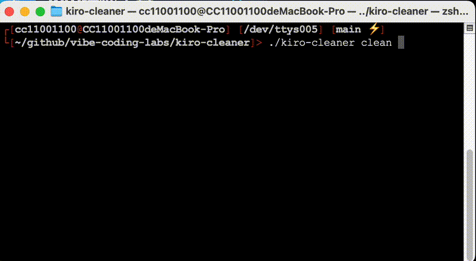

# Kiro Cleaner - Data Cleanup Tool for Kiro AI

[简体中文](README.zh-CN.md) | English

## 🚀 Is Kiro IDE Lagging? Clean It Up and Speed It Up Instantly!

**When conversation history files accumulate, Kiro IDE becomes noticeably slower and laggy.** Kiro Cleaner is a specialized tool designed to solve this problem by safely cleaning up redundant conversation data, cache files, and logs, making your Kiro IDE fly again!

### 💡 Why You Need Kiro Cleaner

- **🐌 Problem**: As you use Kiro IDE, conversation history accumulates in the database, causing the IDE to slow down, lag, and even freeze
- **⚡ Solution**: Kiro Cleaner intelligently cleans redundant data, **instantly restoring IDE responsiveness and significantly improving performance**
- **🛡️ Safety**: Automatic backup before cleanup, restore anytime - never worry about data loss

🌐 **Official Website**: [https://vibe-coding-labs.github.io/kiro-cleaner/](https://vibe-coding-labs.github.io/kiro-cleaner/)

## ✨ Features

- 🔍 **Smart Scanning**: Automatically discovers Kiro data storage locations and analyzes storage usage
- 🧹 **Safe Cleanup**: Rule-based intelligent cleanup ensuring data safety, **solves IDE lag issues**
- 💾 **Auto Backup**: Automatically creates backups before cleanup with compression and incremental backup support
- ⚙️ **Flexible Configuration**: Supports custom cleanup rules and strategies
- 📊 **Detailed Reports**: Provides before/after comparison and space savings statistics
- 🔄 **Rollback Support**: Supports cleanup operation rollback
- 🎨 **Beautiful Interface**: Colorful output and progress display
- 🚀 **Cross-Platform**: Supports macOS, Windows, and Linux

## 🎯 When Do You Need Kiro Cleaner?

### 1. 🐌 IDE Running Slow
**Symptom**: Kiro IDE responds slowly, lags severely, or even freezes  
**Cause**: Large local cache and conversation history are the main culprits!  
**Solution**: After cleaning redundant data with Kiro Cleaner, **IDE takes off immediately with significantly improved response speed**

### 2. 💾 Insufficient Storage
**Symptom**: Your disk space is running low  
**Solution**: Kiro Cleaner can clean conversation history, cache, and temporary files to **free up large amounts of storage space**

### 3. 🔄 Frequent Project Switching
**Symptom**: You switch between multiple projects  
**Solution**: Regular cleanup can **avoid project data confusion and keep IDE running smoothly**

### 4. 🛠️ Long-term Use Maintenance
**Symptom**: You use Kiro IDE for a long time  
**Solution**: Regular maintenance can **prevent data accumulation and avoid performance degradation**

## 📋 System Requirements

- Go 1.21+
- Supported OS: macOS 10.15+, Windows 10+, Linux (kernel 4.0+)

## 🚀 Quick Start

### Demo

Here's a demonstration of running the `kiro-cleaner scan` command in the terminal:


Here's a demonstration of running the `kiro-cleaner clean` command in the terminal (3x speed):



### Installation

#### Build from Source

```bash
# Clone the repository
git clone https://github.com/vibe-coding-labs/kiro-cleaner.git
cd kiro-cleaner

# Build
make build-local

# Install to system (optional)
sudo make install
```

#### Using Pre-compiled Binaries

Download pre-compiled binaries for your operating system from the [Releases](https://github.com/vibe-coding-labs/kiro-cleaner/releases) page.

### Usage

#### Basic Usage

```bash
# Scan Kiro data storage
./kiro-cleaner scan

# Preview cleanup operations
./kiro-cleaner preview

# Execute cleanup (dry-run mode)
./kiro-cleaner clean --dry-run

# Execute cleanup (actual execution)
./kiro-cleaner clean --backup

# List backups
./kiro-cleaner backup list

# Restore backup
./kiro-cleaner backup restore <backup-id>
```

#### Command Line Options

```bash
./kiro-cleaner --help

Available Commands:
  scan         Scan Kiro data storage
  preview      Preview cleanup operations
  clean        Execute data cleanup
  backup       Manage backups
  config       Manage configuration

Global Options:
  --config, -c     Configuration file path
  --verbose, -v    Verbose output
  --output, -o     Output format (table|json|csv)
  --config-dir     Configuration directory path
```

## 📁 Project Structure

```
kiro-cleaner/
├── cmd/kiro-cleaner/          # Main program entry
├── internal/                  # Internal modules
│   ├── config/               # Configuration management
│   ├── scanner/              # Data scanning
│   ├── cleaner/              # Cleanup engine
│   ├── backup/               # Backup management
│   ├── database/             # Database operations
│   ├── storage/              # Storage detection
│   ├── ui/                   # User interface
│   └── utils/                # Utility functions
├── pkg/types/                # Public type definitions
├── assets/                   # Static resources
├── test/                     # Test files
├── Makefile                  # Build scripts
├── go.mod                    # Go module file
└── README.md                 # Project documentation
```

## 🏗️ Architecture Design

### Core Modules

#### 1. Scanner
- Automatically discovers Kiro storage paths
- Scans and analyzes file types
- Calculates storage statistics
- Generates cleanup recommendations

#### 2. Cleaner (Cleanup Engine)
- Rule Engine: Matches files based on conditions
- Safety Checks: Ensures cleanup operations are safe
- Execute Cleanup: Actually deletes or moves files
- Progress Tracking: Real-time cleanup progress display

#### 3. Backup Manager
- Auto Backup: Creates backups before cleanup
- Compressed Storage: Saves storage space
- Version Management: Supports multiple backup versions
- Quick Recovery: Restores data from backups

#### 4. Database Operations
- SQLite connection and management
- Conversation record queries and cleanup
- Data integrity checks
- Database optimization

### Cleanup Rules

The tool supports flexible cleanup rule configuration:

```json
{
  "name": "temp_file_cleanup",
  "description": "Clean up temporary files",
  "priority": 1,
  "enabled": true,
  "conditions": [
    {
      "type": "file_type",
      "field": "file_type",
      "operator": "=",
      "value": "temp"
    }
  ],
  "actions": [
    {
      "type": "delete",
      "backup": false
    }
  ]
}
```

## ⚙️ Configuration

### Default Configuration

The tool initializes with default configuration, which can also be customized via configuration file:

```json
{
  "kiro_paths": {
    "auto_detect": true,
    "custom_paths": []
  },
  "cleanup_rules": [
    // Cleanup rule configuration
  ],
  "backup_config": {
    "enabled": true,
    "path": "~/.kiro-cleaner/backups",
    "max_backups": 5,
    "compressed": true
  },
  "safety_checks": {
    "min_disk_space": "100MB",
    "verify_database": true,
    "require_confirmation": true,
    "backup_before_delete": true
  },
  "ui": {
    "show_progress": true,
    "detailed_output": false,
    "color_output": true
  }
}
```

### Custom Configuration

```bash
# Use custom configuration file
./kiro-cleaner --config /path/to/config.json scan

# Edit configuration file
./kiro-cleaner config edit
```

## 🧪 Testing

### Running Tests

```bash
# Run all tests
make test

# Run unit tests
go test ./test/unit/...

# Run integration tests
go test ./test/integration/...

# Generate test coverage report
make test-coverage
```

### Test Data

Tests use mock data including:
- Mock Kiro directory structure
- Mock database files
- Mock various file types

## 🔧 Development

### Development Environment Setup

```bash
# Install development dependencies
make deps

# Code formatting
make fmt

# Code linting
make lint

# Run in development mode
make dev
```

### Adding New Features

1. Add code in the appropriate `internal/` module
2. Add corresponding unit tests
3. Update documentation and configuration
4. Run tests to ensure functionality works

## 📊 Usage Examples

### Example 1: Basic Cleanup Workflow

```bash
# 1. Scan data storage
$ ./kiro-cleaner scan
🔍 Scanning Kiro data storage...
� Database file: /Users/user/Library/Application Support/Kiro/conversations.db (125.6 MB)
� Config file: /Users/user/Library/Application Support/Kiro/config.json (2.1 KB)
🗂️ Cache directory: /Users/user/Library/Application Support/Kiro/cache/ (89.3 MB)
�📝 Logs directory: /Users/user/Library/Application Support/Kiro/logs/ (15.7 MB)
🗑️ Temp directory: /Users/user/Library/Application Support/Kiro/temp/ (3.2 MB)

Total storage used: 235.9 MB
Scan complete! Found 1,247 cleanable items (estimated savings: 67.8 MB)

# 2. Preview cleanup operations
$ ./kiro-cleaner preview
🧹 Cleanup Preview (estimated savings: 67.8 MB):

1. Temporary files (3.2 MB)
   - temp_session_*.tmp (1.5 MB)
   - download_cache/* (1.7 MB)

2. Old log files (15.7 MB)
   - app_2024-01-*.log (12.3 MB)
   - error_2024-01-*.log (3.4 MB)

3. Expired cache (45.2 MB)
   - model_cache_v1/* (28.9 MB)
   - response_cache/expired/* (16.3 MB)

4. Old conversation records (3.7 MB)
   - 15 conversation records (last activity: 30+ days ago)

Continue with cleanup? (y/N): y

# 3. Execute cleanup
$ ./kiro-cleaner clean --backup
🧹 Starting cleanup...
[████████████████████████████████████████] 100% (1,247/1,247)

✅ Cleanup complete!
📊 Cleanup results:
   - Deleted 892 temporary files (3.2 MB)
   - Cleaned 23 old log files (15.7 MB)
   - Removed 315 expired cache files (45.2 MB)
   - Removed 15 old conversation records (3.7 MB)

💾 Total savings: 67.8 MB
💾 Backup created at: /Users/user/kiro-cleaner-backups/backup_20241201_143022.zip
```

### Example 2: Backup Management

```bash
# List backups
$ ./kiro-cleaner backup list
💾 Available backups:

1. backup_20241201_143022.zip (67.8 MB) - 2024-12-01 14:30:22
2. backup_20241130_093045.zip (125.3 MB) - 2024-11-30 09:30:45
3. backup_20241129_160712.zip (89.1 MB) - 2024-11-29 16:07:12

# Restore backup
$ ./kiro-cleaner backup restore backup_20241201_143022
🔄 Starting backup restoration...
✅ Backup restored: 1,247 items restored
```

## 🛠️ Troubleshooting

### Common Issues

#### 1. Kiro Data Not Found

```bash
$ ./kiro-cleaner scan
❌ Error: Kiro data storage path not found

Solutions:
- Ensure Kiro is properly installed and has been run
- Check if Kiro's data storage path is correct
- Use --config parameter to specify custom path
```

#### 2. Insufficient Permissions

```bash
$ ./kiro-cleaner clean
❌ Error: Insufficient permissions to access files

Solutions:
- Run with administrator privileges
- Check file permission settings
- Ensure sufficient disk space
```

#### 3. Backup Failed

```bash
$ ./kiro-cleaner clean --backup
⚠️  Warning: Backup creation failed: Insufficient disk space

Solutions:
- Free up more disk space
- Disable backup: ./kiro-cleaner clean --no-backup
- Specify backup path: --backup-path /path/to/large/disk
```

### Logging and Debugging

```bash
# Enable verbose output
./kiro-cleaner --verbose scan

# View build information
./kiro-cleaner version

# Generate diagnostic report
./kiro-cleaner --verbose --output json scan > diagnostic.json
```

## 🤝 Contributing

Contributions are welcome! Please follow these steps:

1. Fork the project
2. Create a feature branch (`git checkout -b feature/amazing-feature`)
3. Commit your changes (`git commit -m 'Add some amazing feature'`)
4. Push to the branch (`git push origin feature/amazing-feature`)
5. Create a Pull Request

### Development Guidelines

- Follow Go code conventions
- Add appropriate tests
- Update relevant documentation
- Ensure all tests pass

## 📄 License

This project is licensed under the Apache 2.0 License. See the [LICENSE](LICENSE) file for details.

## 🙏 Acknowledgments

Thanks to all developers who have contributed to this project!

## 📞 Support

If you encounter issues or have suggestions:

1. Check the [Troubleshooting](#troubleshooting) section
2. Search existing [Issues](https://github.com/vibe-coding-labs/kiro-cleaner/issues)
3. Create a new [Issue](https://github.com/vibe-coding-labs/kiro-cleaner/issues/new)
4. Join [Discussions](https://github.com/vibe-coding-labs/kiro-cleaner/discussions)

---

**Disclaimer**: This tool modifies or deletes files. Please backup important data before use. The author is not responsible for any data loss.
