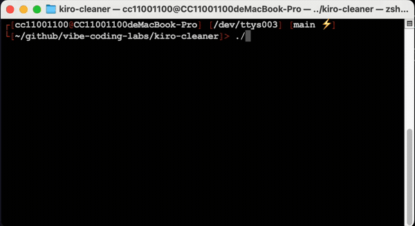
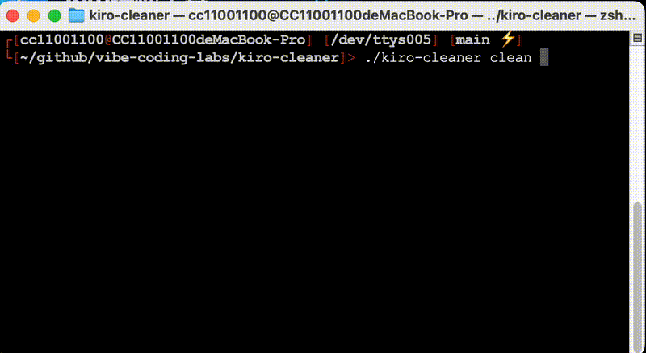

# Kiro Cleaner

简体中文 | [English](README.md)

**清理 Kiro IDE 数据，立即提速。** 自动扫描并安全删除冗余的对话数据、缓存文件和日志。

🌐 **官方网站**: [https://vibe-coding-labs.github.io/kiro-cleaner/](https://vibe-coding-labs.github.io/kiro-cleaner/)

## 演示

**扫描命令:**



**清理命令:**



## 快速开始

### 安装

```bash
# 从源码构建
git clone https://github.com/vibe-coding-labs/kiro-cleaner.git
cd kiro-cleaner
make build-local
sudo make install
```

或从 [Releases](https://github.com/vibe-coding-labs/kiro-cleaner/releases) 下载预编译二进制文件。

### 使用方法

```bash
# 扫描Kiro数据存储
./kiro-cleaner scan

# 预览清理操作
./kiro-cleaner preview

# 执行清理（带备份）
./kiro-cleaner clean --backup

# 管理备份
./kiro-cleaner backup list
./kiro-cleaner backup restore <backup-id>
```

## 许可证

Apache 2.0 许可证。详情请见 [LICENSE](LICENSE) 文件。
